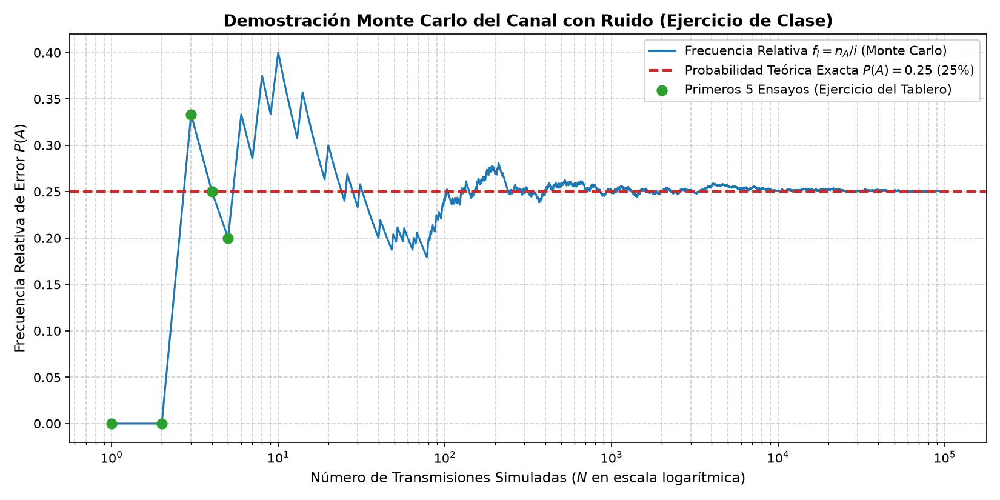
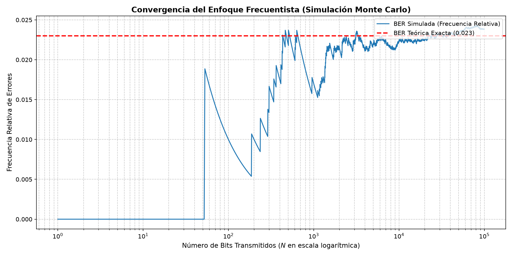
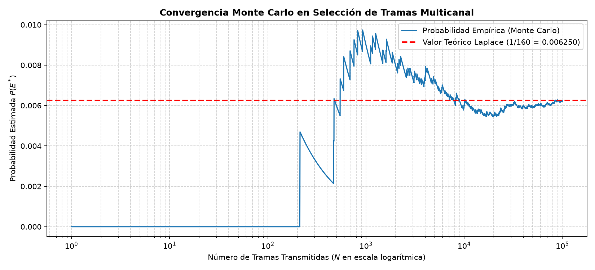

# Probabilidad y Estadística — Simulaciones del Capítulo 1

Universidad Distrital Francisco José de Caldas
Facultad de Ingeniería | Programa de Ingeniería Electrónica
Profesor: Ing. Roberto Cárdenas, D. Ing.

Simulaciones de Monte Carlo del **Capítulo 1: Fundamentos de Incertidumbre y
Espacios de Probabilidad**.

## Requisitos

- Python 3.9 o superior
- NumPy y Matplotlib

## Instalación

```bash
pip install -r requirements.txt
```

## Ejecución

Cada simulación es un script independiente. Se ejecutan así:

```bash
python simulaciones/simulacion_tablero.py
python simulaciones/laboratorio_1_1_ber.py
python simulaciones/laboratorio_1_2_multicanal.py
```

Cada script imprime sus resultados en consola (cuando aplica) y abre una
ventana con la gráfica de convergencia.

### Generar las figuras como archivos PNG

Si no tienes pantalla disponible o quieres guardar las gráficas en disco:

```bash
python herramientas/generar_figuras.py
```

Esto ejecuta las tres simulaciones y guarda los PNG en la carpeta `figuras/`.
Los scripts de los laboratorios no se modifican: el generador solo reemplaza
`plt.show()` por el guardado del archivo.

## Simulaciones

### `simulacion_tablero.py` — Sección 1.5

Ejercicio del tablero: se transmite un bit 0 (0 V) por un canal que inyecta
ruido uniforme entre −1.0 V y +1.0 V. Hay error cuando el ruido es
`v_N >= 0.5 V`.

Imprime los primeros 5 ensayos (los mismos de la tabla manual de clase) y
grafica cómo la frecuencia relativa converge al valor teórico geométrico
`P(A) = 0.5 / 2.0 = 0.25` (25%).



### `laboratorio_1_1_ber.py` — Sección 1.7

Laboratorio Virtual 1.1: estimación de la Tasa de Error de Bit (BER) mediante
Monte Carlo sobre 100 000 bits transmitidos.

Grafica la convergencia de la frecuencia relativa de errores hacia la BER
teórica de 0.023 (2.3%).



### `laboratorio_1_2_multicanal.py` — Sección 1.11

Laboratorio Virtual 1.2: validación del espacio muestral en transmisión
multicanal con `N = 6` canales, `k = 3` activos y `M = 2` niveles de tensión.

Construye el espacio muestral con `itertools`, calcula la cardinalidad
`|Ω| = C(6,3) · 2³ = 160` y verifica por Monte Carlo la probabilidad de
Laplace `P(E*) = 1/160 = 0.00625`.



## Nota sobre reproducibilidad

Los tres scripts fijan la semilla con `np.random.seed(2026)`, tal como se
indica en el documento, para que los resultados sean reproducibles en clase.
Por eso las gráficas de arriba son idénticas a las que obtendrás al ejecutar
las simulaciones en tu equipo.
